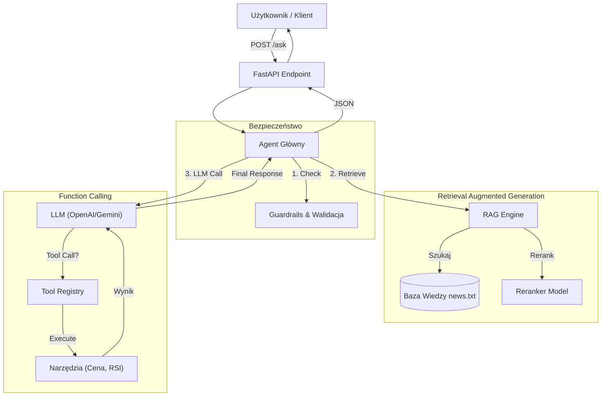

# Agent Analityka Finansowego (LLM Project)

Projekt jest inteligentnym agentem AI zdolnym do przeprowadzania analiz finansowych przy użyciu narzędzi (Ceny akcji, Analiza techniczna, RSI) oraz systemu RAG (Retrieval Augmented Generation) dostarczającego kontekst z wiadomości finansowych.

## Funkcjonalności
- **Tryb API i Lokalny**: Obsługa OpenAI (GPT-3.5/4) oraz Google Gemini.
- **Function Calling**: Zaawansowany dispatcher narzędzi ze ścisłą walidacją argumentów (Pydantic) i typowaniem.
- **System Mini-RAG**: Wyszukiwanie semantyczne oparte na embeddingach (`sentence-transformers` + `faiss`) z rerankingiem (Cross-Encoder) dla zwiększenia precyzji.
- **Guardrails (Bezpieczeństwo)**:
  - Ochrona przed Prompt Injection (heurystyki).
  - Walidacja wyjścia (blokada słów zakazanych).
  - Sanitacja ścieżek (ochrona przed Path Traversal).
- **REST API**: Endpoint `/ask` w technologii FastAPI.
- **Ewaluacja**: Zautomatyzowany zestaw testów z raportem skuteczności.
- **Bonus**: Automatyczny skrypt Red-Team (`red_team.py`) weryfikujący odporność na ataki.

## Instrukcja Uruchomienia

### 1. Instalacja zależności
Upewnij się, że masz zainstalowanego Pythona (3.9+).
```bash
pip install -r requirements.txt
```

### 2. Konfiguracja środowiska
Skopiuj plik `.env.template` do `.env` i uzupełnij swój klucz API:
```bash
# Windows (PowerShell)
copy .env.template .env
```
Edytuj plik `.env` wpisując klucz `OPENAI_API_KEY` (działa też z kluczami Google `AIza...`).

### 3. Uruchomienie API
Serwer wystartuje pod adresem `http://localhost:8000`.
```bash
uvicorn app.main:app --reload
```

### 4. Uruchomienie testów i ewaluacji
Aby wygenerować raport z testów (`evaluation_report.md`):
```bash
python evaluate.py
```

### 5. Testy Bezpieczeństwa (Red Team)
Aby sprawdzić odporność na ataki (Injection, Path Traversal):
```bash
python red_team.py
```
Raport zostanie zapisany w `red_team_report.json`.

## Użycie API

**Endpoint**: `POST /ask`

**Przykładowe żądanie (JSON)**:
```json
{
  "query": "Jaka jest cena akcji AAPL i ich prognoza na przyszły tydzień?"
}
```

**Przykładowa odpowiedź**:
```json
{
  "answer": "Cena akcji AAPL wynosi 145.20 USD. Biorąc pod uwagę RSI na poziomie 35, sugeruje to trend wzrostowy...",
  "tool_calls": [
    {
       "tool": "get_stock_price",
       "args": { "ticker": "AAPL" }
    }
  ]
}
```

## Architektura Systemu

System składa się z 4 głównych modułów, połączonych w następujący sposób:



1.  **Dispatcher (`app/registry.py`)**: Centralny rejestr z walidacją Pydantic.
2.  **Agent (`app/agent.py`)**: Logika sterująca, RAG i komunikacja z LLM.
3.  **RAG Engine (`app/rag.py`)**: Wyszukiwanie hybrydowe (Embeddingi + Reranking).
4.  **Bezpieczeństwo (`app/guardrails.py`)**: Filtrowanie wejścia i wyjścia.

## Demo
**Demo - Mock**:


**Demo - API**:


## Struktura Plików
*   `app/` - Kod źródłowy aplikacji (agent, narzędzia, API).
*   `tests/` - Testy jednostkowe i integracyjne.
*   `data/` - Pliki danych dla RAG.
*   `evaluate.py` - Skrypt uruchamiający ewaluację.
*   `red_team.py` - Skrypt uruchamiający testy bezpieczeństwa.
*   `requirements.txt` - Lista bibliotek.

